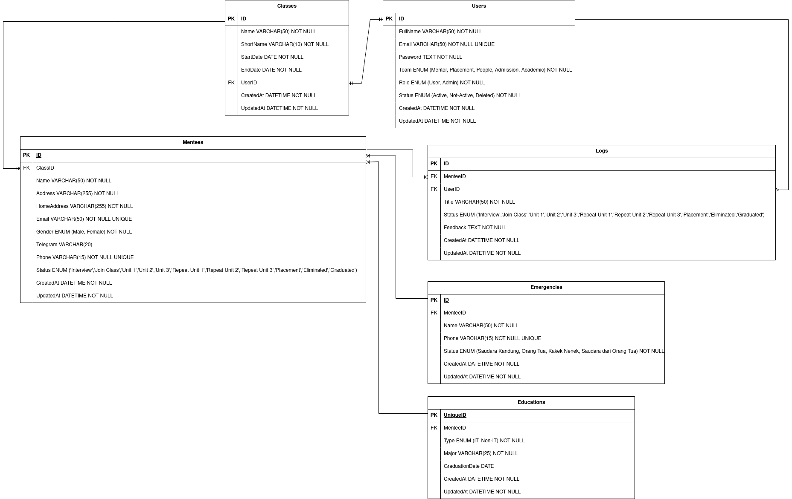

# Immersive Dashboard

## 💻 About The Project

Immersive Dashboard is a web application-based that is designed to manage immersive students at Alterra Academy.

## ✨ App Features
:white_check_mark: User can login and update data.\
:white_check_mark: Superadmin (Manager) can add new users (such as Mentor, Placement Team, People Skill Team), update data end delete users.\
:white_check_mark: User can see all registered users.\
:white_check_mark: User can create classes, edit, delete, and see class content.\
:white_check_mark: User can add mentee (students), view all mentees, edit mentees data, filter mentees list by classes, categories (IT and Non IT), and statuses (Interview, Join Class, Unit 1, Unit 2, Unit 3, Repeat Unit 1, Repeat Unit 2, Repeat Unit 3, Placement, Eliminated, Graduated).\
:white_check_mark: User can edit/change mentee's status.\
:white_check_mark: User can add feedback/log for mentee.

## 🛠 &nbsp;Build App & Database


## 🗃️ ERD



## OpenAPI Documentation

If you want to consume open api <a href="https://app.swaggerhub.com/apis/ASPEAKER427_1/immersive-dashboard-app_api/1.0"> here </a>

## Run Locally

Clone the project

```bash
https://github.com/GP2-Team3/ALTA-Dashboard-BE.git
```

Go to the project directory

```bash
cd ALTA-Dashboard-BE
```
## 👥 Credit

[](https://github.com/velocyes)
[](https://github.com/hdkef)

<h3>
<p align="center">:copyright: 2023  </p>
</h3>
